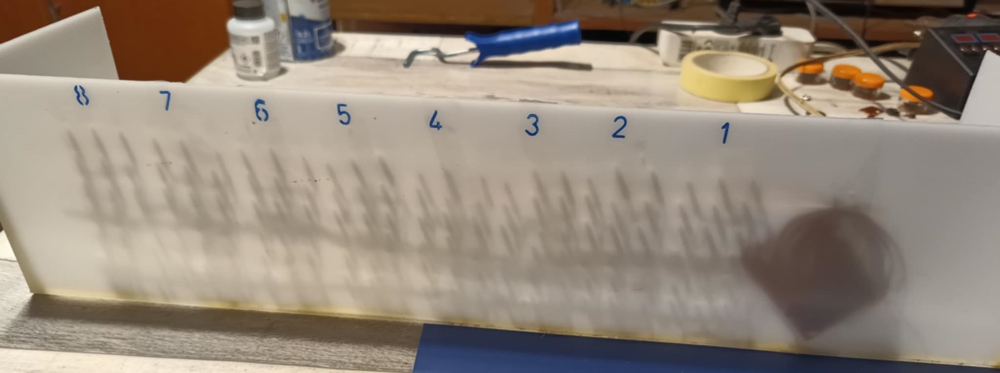

  

# Eight-Segment Display with Arduino Uno

Welcome to the repository for my first-ever project on GitHub! 🎉 This project has a special place in my heart, as it represents my initial steps into the world of coding and hardware. Even though it's far from perfect, I keep it here for its historical value. 😊

## Project Overview

This project involves an **eight-segment display** controlled by an **Arduino Uno** and a **74HC595 shift register**. The display is designed to showcase data in the form of digits, binary numbers, and simple characters. It uses **blue LEDs** and a custom-built power supply to operate effectively.

### Key Features:
- **Custom Power Supply**: Built with an LM337 chip, capable of delivering up to 20W with voltage regulation.
- **Control Mechanism**: Transistors (BD139) act as switches to manage the power supply to LEDs.
- **Input Devices**: The system interacts with a potentiometer, numeric keypad, and a distance sensor for various functionalities.

### Codes Included:
1. **Automatic Segment Lighting**: A simple demonstration of lighting up segments sequentially.
2. **Manual Segment Control**: Control individual segments using a keypad.
3. **Dynamic Mode Switching**: Adjust display behavior and timing using a potentiometer.
4. **Distance Indicator**: Utilize the display to show distances measured by an ultrasonic sensor.

> **Warning**: Ensure the regulated power supply voltage does not exceed 5V to avoid damaging the LEDs. Additionally, the system is not suitable for extended operation due to limited thermal dissipation.

## Why This Project Exists

This was my first attempt at combining hardware and software into a cohesive system. I decided to keep it on GitHub as a reminder of my progress and learning journey. It’s a simple project, but one that laid the foundation for many more to come.

## Usage

1. Connect the components as described in the schematic (see PDF).
2. Upload the desired code to the Arduino Uno using the Arduino IDE.
3. Power up the system and watch it in action!

Feel free to explore, experiment, and share your feedback. Remember, this is a learning milestone—no fancy features, just pure passion for tinkering with electronics!
